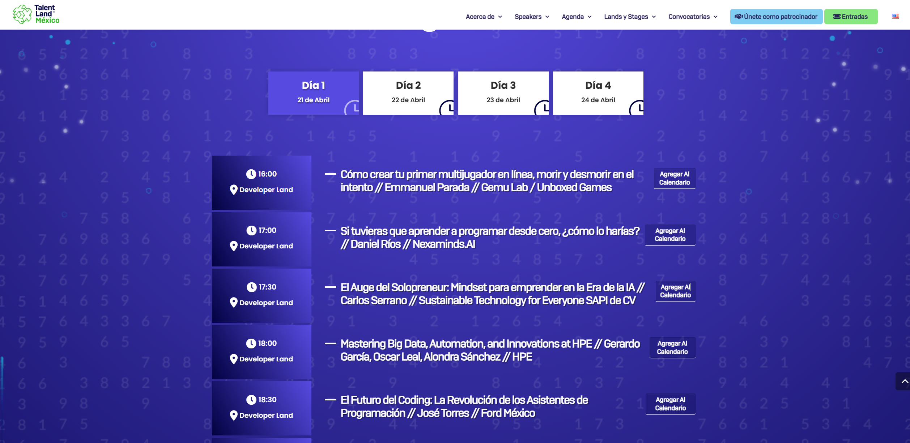
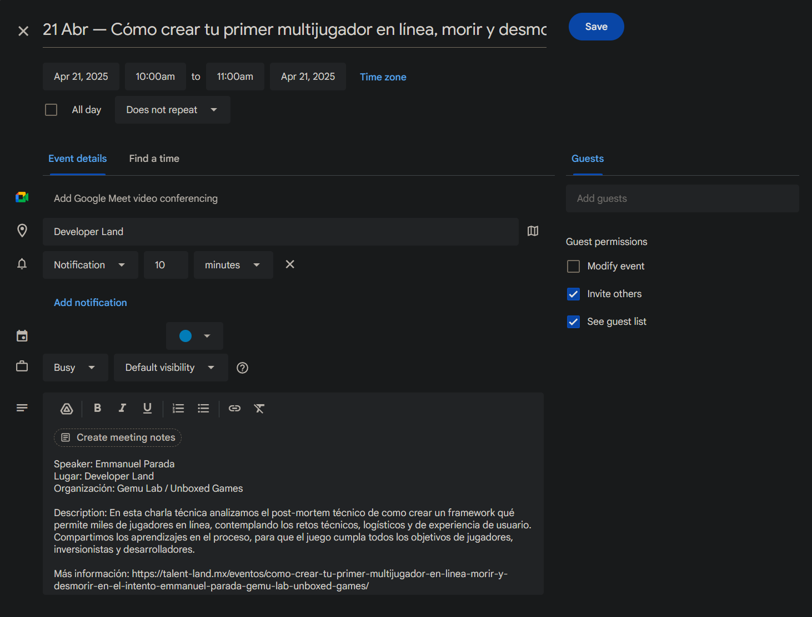

# Talent Land Planner

Extensión web para facilitar la planeación de asistencia a los eventos de Talent Land.

## Instalación

1. Obtén la versión más reciente de la extensión [aquí](https://github.com/POWRFULCOW89/talent-land-planner/releases/).

2. Navega a la sección de extensiones de tu navegador:

   - Chrome: [`chrome://extensions/`](chrome://extensions/)
   - Firefox: [`about:addons`](about:addons)
   - Edge: [`edge://extensions/`](edge://extensions/)
   - Brave: [`brave://extensions/`](brave://extensions/)
   - Opera: [`opera://extensions/`](opera://extensions/)

3. Activa el _"Modo de desarrollador"_ (en Chrome y Edge) o _"Modo de extensiones no firmadas"_ (en Firefox) y carga la extensión.

## Uso

Simplemente navega a tu página de Land deseada y comienza a agregar eventos al calendario con el botón al lado de cada título

## Ejemplo

Al navegar a una Land, las acciones se ven así:

Y los eventos son creados de la siguiente forma:

